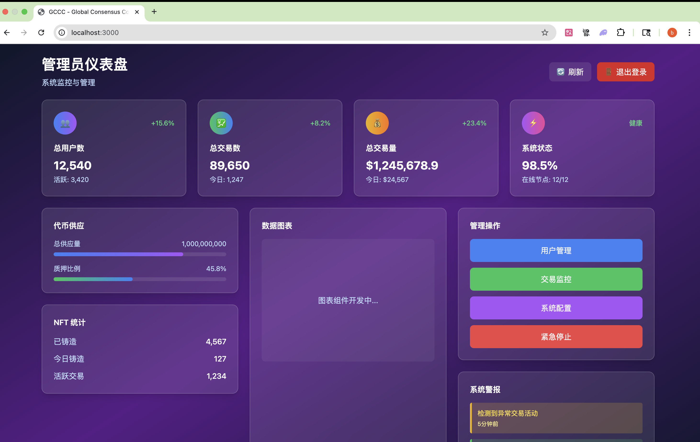

# GCCC (Global Consensus Commemorative Coin)

基于 Solana 区块链的去中心化治理和 NFT 合成平台。

## 项目概述

GCCC 是一个创新的 Web3 项目，结合了代币经济学、去中心化治理、NFT 合成和社区参与机制。通过质押、投票、抽奖等多种方式，为用户提供全方位的区块链体验。

## 项目结构

```
GCCC/
├── docs/                   # 📚 设计文档
│   ├── design/            # 详细设计文档
│   │   ├── frontend/      # 前端模块设计
│   │   ├── 开发文档.md    # 主要开发文档
│   │   ├── 需求文档.md    # 需求规格说明
│   │   ├── 游戏规则.md    # 游戏规则和机制
│   │   └── Global_consensus.txt # 全球共识文档
│   ├── images/           # 📸 应用截图
│   │   ├── login.png     # 登录页面截图
│   │   ├── user.png      # 用户仪表盘截图
│   │   ├── admin.png     # 管理员仪表盘截图
│   │   └── README.md     # 截图说明文档
│   └── README.md          # 文档说明
├── src/                   # 💻 源代码
│   ├── frontend/          # React + TypeScript 前端 ✅
│   │   ├── src/          # 主要源代码
│   │   │   ├── components/ # React组件
│   │   │   │   ├── auth/  # 认证组件
│   │   │   │   ├── dashboard/ # 仪表盘组件
│   │   │   │   └── layout/ # 布局组件
│   │   │   ├── contexts/  # React上下文
│   │   │   ├── types/     # TypeScript类型定义
│   │   │   └── styles/    # 样式文件
│   │   ├── tests/        # 测试文件 ✅
│   │   ├── demo/         # 用户管理模块演示 ✅
│   │   └── README.md     # 前端开发指南
│   ├── backend/           # Node.js + Express 后端
│   │   └── README.md     # 后端开发指南
│   ├── database/          # PostgreSQL + Redis 数据库 ✅
│   │   ├── deploy_database.ps1  # 🚀 统一部署脚本
│   │   ├── check_status.ps1     # 📊 状态检查脚本
│   │   └── README.md            # 数据库部署指南
│   ├── smart-contracts/   # Solana + Anchor 智能合约
│   │   └── README.md     # 智能合约文档
│   ├── test/             # 🧪 测试套件
│   │   ├── frontend/     # 前端测试
│   │   ├── backend/      # 后端测试
│   │   ├── integration/  # 集成测试
│   │   └── README.md     # 测试指南
│   └── README.md         # 源码总览
└── README.md             # 本文件
```

## 🚀 快速开始

### 数据库部署

**一键部署数据库服务（推荐）：**

```powershell
# 进入数据库目录
cd src/database

# 快速部署（使用本地镜像，1-2秒完成）
.\deploy_database.ps1

# 或者强制拉取最新镜像
.\deploy_database.ps1 -PullLatest

# 检查部署状态
.\deploy_database.ps1 -Action status
```

**特性：**

- ⚡ **超快部署**：1-2 秒完成（使用本地镜像）
- 🎯 **智能管理**：自动检测本地镜像，避免不必要下载
- 🛡️ **可靠稳定**：网络问题时自动回退到本地镜像
- 🔧 **环境隔离**：支持开发/测试/生产环境
- 📊 **健康监控**：自动检查服务状态

### 前端开发

```bash
cd src/frontend
npm install
npm start
```

### 后端开发

```bash
cd src/backend
npm install
npm start
```

## 核心特性

### 🔐 用户管理系统

- 钱包连接认证（支持 Phantom、Solflare 等）
- 用户资料管理和 KYC 认证
- VIP 等级系统和经验值机制
- 推荐系统和社交功能

### 🏛️ 去中心化治理

- 提案创建和管理
- 基于代币的投票机制
- 投票权重计算
- 提案执行自动化

### 💰 质押系统

- 多层次质押池
- 动态收益率
- 锁定期灵活配置
- VIP 等级加成

### 🎲 抽奖系统

- 去中心化随机数生成
- 多种奖励类型
- 公平透明的开奖机制
- 历史记录查询

### 🎨 NFT 合成系统

- 独特的合成算法
- 稀有度系统
- 属性随机生成
- 合成历史追踪

## 应用界面展示

### 🔐 登录认证系统


**主要功能:**

- 用户注册和登录
- 表单验证和错误处理
- 响应式设计
- 现代化 UI 界面

### 👤 用户仪表盘


**核心功能:**

- 📊 资产总览和 24 小时变化
- 💰 SOL 余额和 GCCC 代币管理
- 🎯 积分系统和等级进度
- 🖼️ NFT 收藏展示
- 🧩 碎片余额和稀有度统计
- 📈 最近活动时间线
- ⚡ 快速操作面板
- 🚪 安全退出登录

### 👨‍💼 管理员仪表盘



**管理功能:**

- 📊 系统统计概览
- 👥 用户增长和活跃度分析
- 💹 交易量和收入监控
- 🪙 代币供应量管理
- 📈 质押比率监控
- 🎨 NFT 铸造统计
- 🏥 系统健康状态
- 🚪 管理员安全退出

> **实时预览**: 访问 [http://localhost:3002](http://localhost:3002) 查看完整的应用界面
>
> **开发环境**: React + TypeScript + Vite + Vitest (50 个单元测试全部通过 ✅)

## 技术架构

### 前端技术栈

- **框架**: React.js + TypeScript + Vite
- **样式**: Tailwind CSS + CSS Modules
- **状态管理**: React Context API
- **认证系统**: 自定义 Auth Context
- **测试框架**: Vitest + React Testing Library
- **开发工具**: ESLint + Prettier + TypeScript

### 数据库部署方案 🗄️

GCCC 提供了多种数据库部署脚本，支持 PostgreSQL 15 和 Redis 7 的快速部署：

#### 1. 简化部署脚本 (推荐)

**使用方法:**

```powershell
# 部署数据库服务
.\src\database\deploy_database_simple.ps1 deploy

# 查看服务状态
.\src\database\deploy_database_simple.ps1 status

# 查看服务日志
.\src\database\deploy_database_simple.ps1 logs

# 重启服务
.\src\database\deploy_database_simple.ps1 restart

# 停止服务
.\src\database\deploy_database_simple.ps1 stop

# 清理环境
.\src\database\deploy_database_simple.ps1 clean
```

**特点:**

- ✅ 基于测试验证的 Docker Compose 命令
- ✅ 支持健康检查和错误处理
- ✅ 自动创建必要的目录结构
- ✅ 彩色输出和详细日志记录

#### 2. 优化部署脚本

**使用方法:**

```powershell
# 使用优化脚本部署（包含本地镜像检查）
.\src\database\deploy_database_optimized_fixed.ps1 -Environment development -Timeout 120

# 强制重新构建
.\src\database\deploy_database_optimized_fixed.ps1 -Environment development -ForceRebuild

# 拉取最新镜像
.\src\database\deploy_database_optimized_fixed.ps1 -Environment development -PullLatest
```

**高级特性:**

- 🔍 智能本地镜像检测
- ⚡ 网络超时处理和重试机制
- 📊 指数退避重试策略
- 🎯 精细化的错误处理

#### 3. 数据库管理工具集

**使用方法:**

```powershell
# 部署服务
.\src\database\database-toolkit.ps1 deploy

# 查看详细状态（包含健康检查和资源使用）
.\src\database\database-toolkit.ps1 status

# 跟踪日志
.\src\database\database-toolkit.ps1 logs -Follow

# 创建数据库备份
.\src\database\database-toolkit.ps1 backup -BackupName "pre_update_backup"

# 恢复数据库
.\src\database\database-toolkit.ps1 restore -RestoreFrom "pre_update_backup.sql"

# 进入数据库 Shell
.\src\database\database-toolkit.ps1 shell

# 完全清理环境
.\src\database\database-toolkit.ps1 clean -Force
```

**完整功能:**

- 🚀 部署、停止、重启、清理
- 📊 详细状态监控和健康检查
- 📝 实时日志查看和历史记录
- 💾 数据库备份和恢复
- 🖥️ 交互式数据库 Shell
- 📈 资源使用统计

#### 4. 直接使用 Docker Compose

**基本命令:**

```bash
# 启动服务（开发环境）
docker-compose --env-file .env.development up -d

# 查看服务状态
docker-compose --env-file .env.development ps

# 查看日志
docker-compose --env-file .env.development logs -f

# 停止服务
docker-compose --env-file .env.development stop

# 完全移除
docker-compose --env-file .env.development down --volumes
```

**连接信息:**

- **PostgreSQL**: `localhost:5432`
  - 用户名: `gccc_user`
  - 密码: `gccc_password`
  - 数据库: `gccc_db`
- **Redis**: `localhost:6379`
  - 密码: `gccc_redis_password`

#### 环境配置文件

需要创建 `.env.development` 文件：

```env
# 项目设置
COMPOSE_PROJECT_NAME=gccc-development

# PostgreSQL 配置
POSTGRES_DB=gccc_db
POSTGRES_USER=gccc_user
POSTGRES_PASSWORD=gccc_password
POSTGRES_HOST=localhost
POSTGRES_PORT=5432

# Redis 配置
REDIS_PASSWORD=gccc_redis_password
REDIS_HOST=localhost
REDIS_PORT=6379

# 数据目录
DATA_DIR=./data
```

### 后端技术栈

- **运行时**: Node.js + Express.js + TypeScript
- **数据库**: PostgreSQL + Redis
- **认证**: JWT + Passport.js
- **API 文档**: Swagger/OpenAPI
- **队列**: Bull Queue

### 智能合约

- **区块链**: Solana
- **框架**: Anchor Framework
- **语言**: Rust
- **代币标准**: SPL Token
- **NFT 标准**: Metaplex

### 基础设施

- **容器化**: Docker + Docker Compose
- **CI/CD**: GitHub Actions
- **监控**: Prometheus + Grafana
- **日志**: ELK Stack

## 快速开始

### 环境要求

- Node.js 18+
- Rust 1.70+
- Solana CLI 1.16+
- Anchor CLI 0.28+
- Docker & Docker Compose

### 本地开发

1. **克隆项目**

```bash
git clone https://github.com/your-username/GCCC.git
cd GCCC
```

2. **安装依赖**

```bash
# 前端依赖
cd src/frontend && npm install

# 后端依赖
cd ../backend && npm install

# 智能合约依赖
cd ../smart-contracts && anchor build
```

3. **环境配置**

```bash
# 复制环境变量模板
cp .env.example .env.local

# 配置数据库和其他服务
```

4. **启动服务**

```bash
# 启动数据库服务
docker-compose up -d postgres redis

# 启动后端服务
cd src/backend && npm run dev

# 启动前端服务
cd src/frontend && npm run dev
```

5. **查看演示**
   访问前端用户管理模块演示：

```bash
# 在浏览器中打开
file:///path/to/GCCC/src/frontend/demo/index.html
```

## 开发状态

### ✅ 已完成

- [x] 项目架构重构
- [x] 详细设计文档（8 个前端模块）
- [x] 用户管理模块前端演示
- [x] 数据库设计文档
- [x] 智能合约架构设计
- [x] 测试框架设计

### 🚧 开发中

- [ ] React 前端应用开发
- [ ] Node.js 后端 API 开发
- [ ] Solana 智能合约实现
- [ ] 数据库迁移和种子数据

### 📋 计划中

- [ ] 钱包集成和认证系统
- [ ] 治理和投票功能
- [ ] 质押和奖励机制
- [ ] 抽奖系统实现
- [ ] NFT 合成功能
- [ ] 生产环境部署

## 贡献指南

### 开发流程

1. Fork 项目到个人仓库
2. 创建功能分支 (`git checkout -b feature/amazing-feature`)
3. 提交变更 (`git commit -m 'Add some amazing feature'`)
4. 推送到分支 (`git push origin feature/amazing-feature`)
5. 创建 Pull Request

### 代码规范

- 使用 TypeScript 严格模式
- 遵循 ESLint 和 Prettier 配置
- 编写测试用例
- 更新相关文档

### 提交规范

使用[Conventional Commits](https://conventionalcommits.org/)格式：

```
type(scope): description

feat: 新功能
fix: 修复bug
docs: 文档更新
style: 代码格式
refactor: 重构
test: 测试
chore: 构建/工具
```

## 社区

### 官方链接

- 🌐 官网: [gccc.community](https://gccc.community)
- 📱 Twitter: [@GCCC_Official](https://twitter.com/GCCC_Official)
- 💬 Discord: [GCCC Community](https://discord.gg/gccc)
- 📖 文档: [docs.gccc.community](https://docs.gccc.community)

### 支持

- 📧 邮箱: support@gccc.community
- 🐛 Bug 报告: [GitHub Issues](https://github.com/your-username/GCCC/issues)
- 💡 功能建议: [GitHub Discussions](https://github.com/your-username/GCCC/discussions)

## 许可证

本项目采用 [MIT License](LICENSE) 开源协议。

## 免责声明

本项目仅用于教育和研究目的。在参与任何代币相关活动之前，请确保遵守当地法律法规。投资有风险，请谨慎参与。
