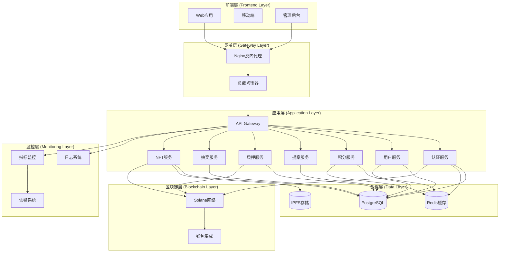
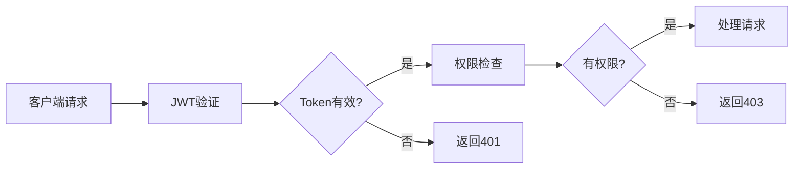
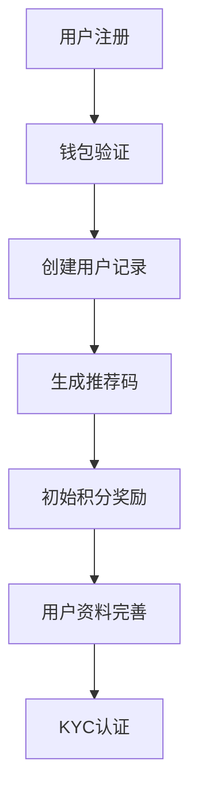
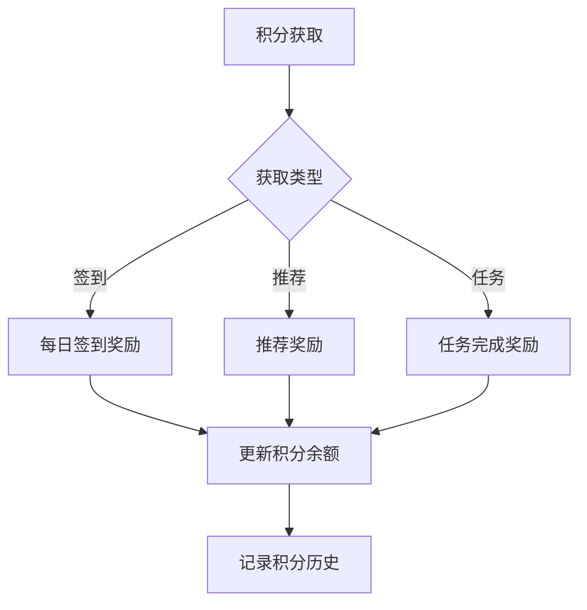
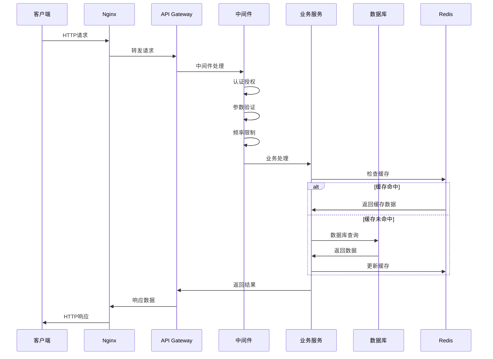
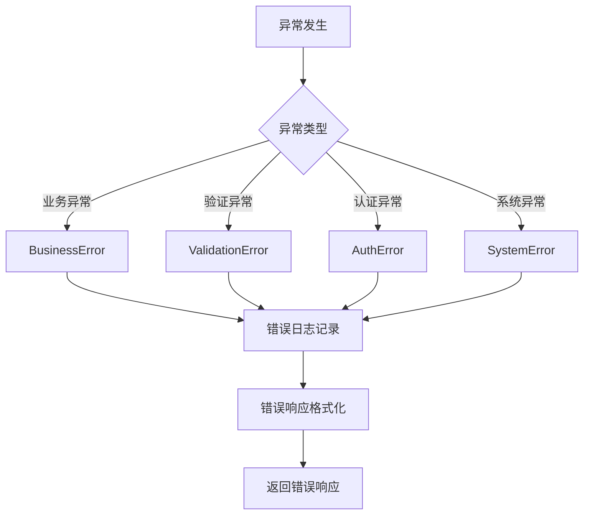
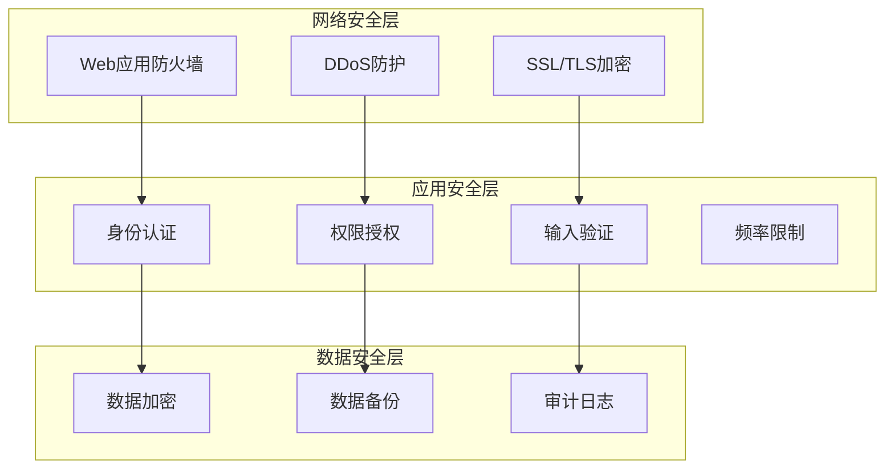
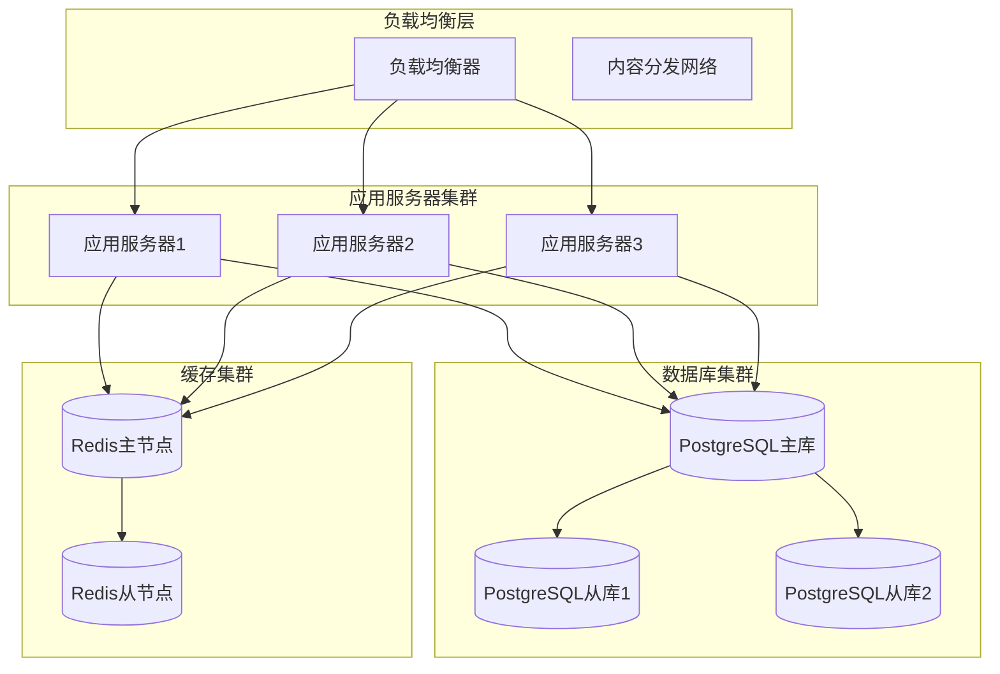

# GCCC 系统架构设计

## 概述

GCCC (Global Consensus Collaboration Council) 是一个基于 Solana 区块链的去中心化治理平台，采用现代化的微服务架构，提供用户管理、积分系统、提案投票、质押奖励、抽奖系统和 NFT 管理等核心功能。

## 系统架构图



## 技术栈选型

### 1. 后端技术栈

| 组件         | 技术选型          | 版本  | 选择理由                           |
| ------------ | ----------------- | ----- | ---------------------------------- |
| **运行环境** | Node.js           | 18+   | 高性能 JavaScript 运行时，生态丰富 |
| **Web 框架** | Express.js        | 4.18+ | 轻量级、灵活、社区成熟             |
| **API 文档** | Swagger           | 3.0+  | 标准化 API 文档生成                |
| **类型检查** | TypeScript        | 5.0+  | 静态类型检查，提高代码质量         |
| **代码规范** | ESLint + Prettier | 最新  | 统一代码风格和质量                 |

### 2. 数据存储

| 组件           | 技术选型           | 版本 | 选择理由                       |
| -------------- | ------------------ | ---- | ------------------------------ |
| **主数据库**   | PostgreSQL         | 15+  | ACID 特性、JSON 支持、性能稳定 |
| **缓存系统**   | Redis              | 6+   | 高性能内存数据库、丰富数据结构 |
| **文件存储**   | IPFS               | 最新 | 去中心化存储、与区块链集成     |
| **数据库 ORM** | Prisma / Sequelize | 最新 | 类型安全、迁移管理             |

### 3. 区块链技术

| 组件           | 技术选型         | 版本           | 选择理由                  |
| -------------- | ---------------- | -------------- | ------------------------- |
| **区块链网络** | Solana           | Mainnet/Devnet | 高性能、低费用、生态丰富  |
| **JS SDK**     | @solana/web3.js  | 1.87+          | 官方 JavaScript SDK       |
| **钱包集成**   | Wallet Adapter   | 最新           | 多钱包支持、标准化接口    |
| **智能合约**   | Anchor Framework | 0.28+          | Solana 开发框架、类型安全 |

### 4. 运维监控

| 组件         | 技术选型            | 版本  | 选择理由                   |
| ------------ | ------------------- | ----- | -------------------------- |
| **容器化**   | Docker              | 最新  | 环境一致性、部署简化       |
| **编排管理** | Docker Compose      | 最新  | 多服务编排、开发环境       |
| **反向代理** | Nginx               | 1.25+ | 高性能、负载均衡、SSL 终止 |
| **进程管理** | PM2                 | 最新  | 进程守护、集群模式、监控   |
| **日志管理** | Winston             | 最新  | 结构化日志、多输出目标     |
| **性能监控** | New Relic / Datadog | 最新  | APM 监控、性能分析         |

## 架构设计原则

### 1. 分层架构

```
┌─────────────────────────────────────┐
│           表现层 (Presentation)      │  ← 用户界面、API接口
├─────────────────────────────────────┤
│           业务层 (Business)          │  ← 业务逻辑、验证规则
├─────────────────────────────────────┤
│           服务层 (Service)           │  ← 外部服务、区块链交互
├─────────────────────────────────────┤
│           数据层 (Data)              │  ← 数据访问、持久化
└─────────────────────────────────────┘
```

**各层职责**:

- **表现层**: HTTP 路由、请求响应处理、参数验证
- **业务层**: 核心业务逻辑、权限控制、业务规则
- **服务层**: 外部 API 调用、区块链交互、文件处理
- **数据层**: 数据库操作、缓存管理、数据持久化

### 2. 模块化设计

```
src/backend/
├── api/                    # API路由层
│   ├── auth/              # 认证模块
│   ├── user/              # 用户模块
│   ├── points/            # 积分模块
│   ├── proposals/         # 提案模块
│   ├── staking/           # 质押模块
│   ├── lottery/           # 抽奖模块
│   └── nft/               # NFT模块
├── services/              # 服务层
│   ├── database/          # 数据库服务
│   ├── blockchain/        # 区块链服务
│   ├── external/          # 外部服务
│   └── cache/             # 缓存服务
├── middleware/            # 中间件
├── utils/                 # 工具函数
└── config/                # 配置管理
```

### 3. 单一职责原则

每个模块和类都有明确的单一职责：

- **Controller**: 处理 HTTP 请求响应
- **Service**: 封装业务逻辑
- **Repository**: 数据访问抽象
- **Middleware**: 横切关注点处理

### 4. 依赖注入

使用依赖注入模式，提高代码的可测试性和可维护性：

```javascript
// 服务注入示例
class UserController {
  constructor(userService, authService) {
    this.userService = userService;
    this.authService = authService;
  }
}
```

## 核心模块设计

### 1. 认证授权模块



**核心功能**:

- 钱包连接验证
- JWT 令牌管理
- 基于角色的权限控制 (RBAC)
- 会话管理

### 2. 用户管理模块



**核心功能**:

- 用户注册登录
- 个人资料管理
- KYC 身份认证
- 推荐系统

### 3. 积分系统模块



**核心功能**:

- 积分获取和消费
- 每日签到系统
- 推荐奖励
- 积分历史记录

## 数据流设计

### 1. 请求处理流程



### 2. 错误处理流程



## 性能优化策略

### 1. 缓存策略

| 缓存层级       | 技术方案     | 缓存时间  | 适用场景             |
| -------------- | ------------ | --------- | -------------------- |
| **浏览器缓存** | HTTP Headers | 1 小时    | 静态资源、用户资料   |
| **CDN 缓存**   | Cloudflare   | 24 小时   | 图片、文档、静态文件 |
| **应用缓存**   | Redis        | 5-30 分钟 | 热点数据、会话信息   |
| **数据库缓存** | Query Cache  | 自动      | 重复查询、连接池     |

### 2. 数据库优化

```sql
-- 索引策略
CREATE INDEX idx_users_wallet_address ON users(wallet_address);
CREATE INDEX idx_proposals_status_created ON proposals(status, created_at);
CREATE INDEX idx_points_history_user_date ON points_history(user_id, created_at);

-- 分区策略
CREATE TABLE points_history_2025 PARTITION OF points_history
FOR VALUES FROM ('2025-01-01') TO ('2026-01-01');
```

### 3. API 性能优化

- **响应压缩**: Gzip 压缩减少传输大小
- **分页查询**: 限制单次查询数据量
- **字段选择**: 只返回需要的字段
- **批量操作**: 减少数据库连接次数
- **异步处理**: 耗时操作异步执行

## 安全设计

### 1. 安全架构



### 2. 安全措施清单

| 安全领域      | 实施措施      | 技术方案                |
| ------------- | ------------- | ----------------------- |
| **身份认证**  | 多因子认证    | JWT + 钱包签名验证      |
| **权限控制**  | RBAC 权限模型 | 基于角色的权限控制      |
| **数据加密**  | 敏感数据加密  | AES-256 + bcrypt        |
| **传输安全**  | HTTPS 强制    | TLS 1.3 + HSTS          |
| **输入验证**  | 参数验证      | Joi/Yup 验证库          |
| **SQL 注入**  | 参数化查询    | ORM 框架 + 预编译语句   |
| **XSS 防护**  | 输出编码      | CSP 策略 + 内容编码     |
| **CSRF 防护** | CSRF 令牌     | SameSite Cookie + Token |
| **频率限制**  | API 限流      | Redis + 滑动窗口        |
| **审计日志**  | 操作记录      | 结构化日志 + 日志分析   |

## 部署架构

### 1. 生产环境架构



### 2. 容器化部署

```yaml
# docker-compose.yml 概要
version: "3.8"
services:
  nginx:
    image: nginx:alpine
    ports: ["80:80", "443:443"]

  backend:
    build: ./src/backend
    environment:
      - NODE_ENV=production
    depends_on: [postgres, redis]

  postgres:
    image: postgres:15
    environment:
      - POSTGRES_DB=gccc_db
    volumes: ["postgres_data:/var/lib/postgresql/data"]

  redis:
    image: redis:6-alpine
    volumes: ["redis_data:/data"]
```

## 监控和运维

### 1. 监控指标

| 监控类型     | 关键指标                 | 告警阈值                   |
| ------------ | ------------------------ | -------------------------- |
| **应用性能** | 响应时间、QPS、错误率    | 响应时间>1s, 错误率>1%     |
| **系统资源** | CPU、内存、磁盘、网络    | CPU>80%, 内存>85%          |
| **数据库**   | 连接数、查询时间、锁等待 | 连接数>80%, 查询时间>500ms |
| **缓存**     | 命中率、内存使用率       | 命中率<90%, 内存>90%       |
| **业务指标** | 用户活跃度、交易量       | 根据业务需求设定           |

### 2. 日志管理

```javascript
// 日志结构化示例
{
  "timestamp": "2025-09-04T10:00:00.000Z",
  "level": "INFO",
  "service": "user-service",
  "traceId": "abc123xyz",
  "userId": "user_123",
  "action": "login",
  "message": "用户登录成功",
  "metadata": {
    "ip": "192.168.1.100",
    "userAgent": "Mozilla/5.0..."
  }
}
```

## 扩展性设计

### 1. 水平扩展策略

- **应用层**: 无状态设计，支持多实例部署
- **数据库**: 读写分离，分库分表
- **缓存**: Redis 集群，数据分片
- **文件存储**: IPFS 分布式存储

### 2. 垂直扩展策略

- **微服务拆分**: 按业务领域拆分服务
- **消息队列**: 异步处理耗时任务
- **事件驱动**: 基于事件的松耦合架构

## 技术债务管理

### 1. 代码质量

- **代码审查**: 强制代码审查流程
- **测试覆盖率**: 目标 80%以上
- **静态分析**: SonarQube 代码质量检查
- **技术文档**: 及时更新技术文档

### 2. 重构策略

- **渐进式重构**: 避免大规模重写
- **向后兼容**: 保持 API 向后兼容
- **性能优化**: 定期性能测试和优化
- **技术栈升级**: 定期升级依赖版本

---

> 📘 **注意**: 本架构设计会随着业务发展和技术演进持续优化调整。建议定期回顾和更新架构设计文档。
