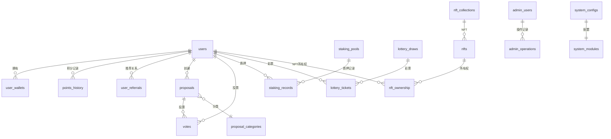

# GCCC 数据模型设计

## 概述

本文档详细描述了 GCCC 系统的数据模型设计，包括所有数据表结构、关系定义、索引策略和数据约束。系统采用 PostgreSQL 作为主数据库，Redis 作为缓存层。

## 数据库架构概览

### 核心数据表关系图



## 核心数据表设计

### 1. 用户管理模块

#### 1.1 用户表 (users)

```sql
CREATE TABLE users (
    -- 主键和基础信息
    id UUID PRIMARY KEY DEFAULT gen_random_uuid(),
    username VARCHAR(50) UNIQUE,                    -- 用户名
    email VARCHAR(255) UNIQUE,                      -- 邮箱
    avatar_url TEXT,                                -- 头像URL

    -- 用户状态
    status VARCHAR(20) DEFAULT 'active'             -- active, inactive, suspended
        CHECK (status IN ('active', 'inactive', 'suspended')),
    kyc_status VARCHAR(20) DEFAULT 'pending'        -- pending, approved, rejected
        CHECK (kyc_status IN ('pending', 'approved', 'rejected', 'in_review')),

    -- 等级系统
    level INTEGER DEFAULT 1 CHECK (level >= 1),    -- 用户等级
    experience INTEGER DEFAULT 0 CHECK (experience >= 0), -- 经验值

    -- 推荐系统
    referral_code VARCHAR(20) UNIQUE,               -- 推荐码
    referred_by UUID REFERENCES users(id),          -- 推荐人
    total_referrals INTEGER DEFAULT 0,              -- 总推荐数
    active_referrals INTEGER DEFAULT 0,             -- 活跃推荐数

    -- 时间戳
    last_login_at TIMESTAMP,                        -- 最后登录时间
    created_at TIMESTAMP DEFAULT CURRENT_TIMESTAMP,
    updated_at TIMESTAMP DEFAULT CURRENT_TIMESTAMP
);

-- 索引
CREATE INDEX idx_users_email ON users(email);
CREATE INDEX idx_users_referral_code ON users(referral_code);
CREATE INDEX idx_users_referred_by ON users(referred_by);
CREATE INDEX idx_users_status ON users(status);
CREATE INDEX idx_users_created_at ON users(created_at);
```

#### 1.2 用户钱包表 (user_wallets)

```sql
CREATE TABLE user_wallets (
    id UUID PRIMARY KEY DEFAULT gen_random_uuid(),
    user_id UUID NOT NULL REFERENCES users(id) ON DELETE CASCADE,

    -- 钱包信息
    wallet_address VARCHAR(50) NOT NULL,            -- 钱包地址
    wallet_type VARCHAR(20) DEFAULT 'solana'        -- 钱包类型
        CHECK (wallet_type IN ('solana', 'ethereum', 'bitcoin')),

    -- 验证状态
    is_primary BOOLEAN DEFAULT false,               -- 是否主钱包
    is_verified BOOLEAN DEFAULT false,              -- 是否已验证
    verification_signature TEXT,                    -- 验证签名
    verification_message TEXT,                      -- 验证消息

    -- 时间戳
    verified_at TIMESTAMP,
    created_at TIMESTAMP DEFAULT CURRENT_TIMESTAMP,
    updated_at TIMESTAMP DEFAULT CURRENT_TIMESTAMP,

    -- 约束
    UNIQUE(user_id, wallet_address),
    CHECK (NOT (is_primary = true AND is_verified = false))
);

-- 索引
CREATE UNIQUE INDEX idx_user_wallets_address ON user_wallets(wallet_address);
CREATE INDEX idx_user_wallets_user_id ON user_wallets(user_id);
CREATE UNIQUE INDEX idx_user_wallets_primary ON user_wallets(user_id)
    WHERE is_primary = true;
```

#### 1.3 用户推荐关系表 (user_referrals)

```sql
CREATE TABLE user_referrals (
    id UUID PRIMARY KEY DEFAULT gen_random_uuid(),
    referrer_id UUID NOT NULL REFERENCES users(id), -- 推荐人
    referee_id UUID NOT NULL REFERENCES users(id),  -- 被推荐人

    -- 推荐信息
    referral_code VARCHAR(20) NOT NULL,             -- 使用的推荐码
    reward_amount DECIMAL(18,6) DEFAULT 0,          -- 奖励金额
    reward_status VARCHAR(20) DEFAULT 'pending'     -- pending, paid, cancelled
        CHECK (reward_status IN ('pending', 'paid', 'cancelled')),

    -- 时间戳
    created_at TIMESTAMP DEFAULT CURRENT_TIMESTAMP,
    rewarded_at TIMESTAMP,

    -- 约束
    UNIQUE(referee_id),  -- 每个用户只能被推荐一次
    CHECK (referrer_id != referee_id)
);

-- 索引
CREATE INDEX idx_user_referrals_referrer ON user_referrals(referrer_id);
CREATE INDEX idx_user_referrals_referee ON user_referrals(referee_id);
CREATE INDEX idx_user_referrals_status ON user_referrals(reward_status);
```

### 2. 积分系统模块

#### 2.1 积分历史表 (points_history)

```sql
CREATE TABLE points_history (
    id UUID PRIMARY KEY DEFAULT gen_random_uuid(),
    user_id UUID NOT NULL REFERENCES users(id),

    -- 积分变动
    points_change DECIMAL(18,6) NOT NULL,           -- 积分变动量(正数为增加，负数为扣除)
    points_balance DECIMAL(18,6) NOT NULL,          -- 变动后余额

    -- 变动原因
    change_type VARCHAR(30) NOT NULL                -- 变动类型
        CHECK (change_type IN (
            'daily_checkin',      -- 每日签到
            'referral_bonus',     -- 推荐奖励
            'task_completion',    -- 任务完成
            'staking_reward',     -- 质押奖励
            'lottery_purchase',   -- 购买彩票
            'nft_purchase',       -- 购买NFT
            'admin_adjustment',   -- 管理员调整
            'system_reward',      -- 系统奖励
            'penalty'             -- 惩罚扣除
        )),
    change_reason TEXT,                             -- 变动原因描述

    -- 关联信息
    related_entity_type VARCHAR(30),               -- 关联实体类型
    related_entity_id UUID,                        -- 关联实体ID

    -- 时间戳
    created_at TIMESTAMP DEFAULT CURRENT_TIMESTAMP
) PARTITION BY RANGE (created_at);

-- 创建分区表（按年分区）
CREATE TABLE points_history_2025 PARTITION OF points_history
FOR VALUES FROM ('2025-01-01') TO ('2026-01-01');

CREATE TABLE points_history_2026 PARTITION OF points_history
FOR VALUES FROM ('2026-01-01') TO ('2027-01-01');

-- 索引
CREATE INDEX idx_points_history_user_id ON points_history(user_id);
CREATE INDEX idx_points_history_type ON points_history(change_type);
CREATE INDEX idx_points_history_created_at ON points_history(created_at);
```

#### 2.2 每日签到记录表 (daily_checkins)

```sql
CREATE TABLE daily_checkins (
    id UUID PRIMARY KEY DEFAULT gen_random_uuid(),
    user_id UUID NOT NULL REFERENCES users(id),

    -- 签到信息
    checkin_date DATE NOT NULL,                     -- 签到日期
    consecutive_days INTEGER DEFAULT 1,            -- 连续签到天数
    points_earned DECIMAL(18,6) NOT NULL,          -- 获得积分

    -- 奖励信息
    bonus_multiplier DECIMAL(4,2) DEFAULT 1.0,     -- 奖励倍数
    is_special_day BOOLEAN DEFAULT false,          -- 是否特殊日期

    -- 时间戳
    created_at TIMESTAMP DEFAULT CURRENT_TIMESTAMP,

    -- 约束
    UNIQUE(user_id, checkin_date)
);

-- 索引
CREATE INDEX idx_daily_checkins_user_date ON daily_checkins(user_id, checkin_date);
CREATE INDEX idx_daily_checkins_date ON daily_checkins(checkin_date);
```

### 3. 提案投票模块

#### 3.1 提案分类表 (proposal_categories)

```sql
CREATE TABLE proposal_categories (
    id UUID PRIMARY KEY DEFAULT gen_random_uuid(),
    name VARCHAR(100) NOT NULL UNIQUE,             -- 分类名称
    description TEXT,                               -- 分类描述
    icon_url TEXT,                                  -- 图标URL

    -- 投票规则
    min_voting_power DECIMAL(18,6) DEFAULT 0,      -- 最小投票权重
    voting_duration_hours INTEGER DEFAULT 168,     -- 投票持续时间(小时)
    min_participation_rate DECIMAL(5,4) DEFAULT 0.1, -- 最小参与率

    -- 状态
    is_active BOOLEAN DEFAULT true,
    sort_order INTEGER DEFAULT 0,

    -- 时间戳
    created_at TIMESTAMP DEFAULT CURRENT_TIMESTAMP,
    updated_at TIMESTAMP DEFAULT CURRENT_TIMESTAMP
);

-- 索引
CREATE INDEX idx_proposal_categories_active ON proposal_categories(is_active);
CREATE INDEX idx_proposal_categories_sort ON proposal_categories(sort_order);
```

#### 3.2 提案表 (proposals)

```sql
CREATE TABLE proposals (
    id UUID PRIMARY KEY DEFAULT gen_random_uuid(),
    creator_id UUID NOT NULL REFERENCES users(id),
    category_id UUID NOT NULL REFERENCES proposal_categories(id),

    -- 基本信息
    title VARCHAR(200) NOT NULL,                   -- 提案标题
    description TEXT NOT NULL,                     -- 提案描述
    content JSONB,                                 -- 提案详细内容(富文本)

    -- 投票设置
    voting_start_time TIMESTAMP NOT NULL,         -- 投票开始时间
    voting_end_time TIMESTAMP NOT NULL,           -- 投票结束时间
    min_voting_power DECIMAL(18,6) DEFAULT 0,     -- 最小投票权重

    -- 状态统计
    status VARCHAR(20) DEFAULT 'draft'             -- draft, active, completed, cancelled
        CHECK (status IN ('draft', 'active', 'completed', 'cancelled', 'executed')),

    total_votes INTEGER DEFAULT 0,                -- 总投票数
    total_voting_power DECIMAL(18,6) DEFAULT 0,   -- 总投票权重
    yes_votes DECIMAL(18,6) DEFAULT 0,            -- 赞成票权重
    no_votes DECIMAL(18,6) DEFAULT 0,             -- 反对票权重
    abstain_votes DECIMAL(18,6) DEFAULT 0,        -- 弃权票权重

    -- 执行信息
    execution_tx_hash VARCHAR(128),               -- 执行交易哈希
    executed_at TIMESTAMP,                        -- 执行时间

    -- 时间戳
    created_at TIMESTAMP DEFAULT CURRENT_TIMESTAMP,
    updated_at TIMESTAMP DEFAULT CURRENT_TIMESTAMP,

    -- 约束
    CHECK (voting_end_time > voting_start_time),
    CHECK (total_voting_power >= 0),
    CHECK (yes_votes + no_votes + abstain_votes <= total_voting_power)
);

-- 索引
CREATE INDEX idx_proposals_creator ON proposals(creator_id);
CREATE INDEX idx_proposals_category ON proposals(category_id);
CREATE INDEX idx_proposals_status ON proposals(status);
CREATE INDEX idx_proposals_voting_time ON proposals(voting_start_time, voting_end_time);
CREATE INDEX idx_proposals_created_at ON proposals(created_at);
```

#### 3.3 投票记录表 (votes)

```sql
CREATE TABLE votes (
    id UUID PRIMARY KEY DEFAULT gen_random_uuid(),
    proposal_id UUID NOT NULL REFERENCES proposals(id),
    voter_id UUID NOT NULL REFERENCES users(id),

    -- 投票内容
    vote_option VARCHAR(10) NOT NULL               -- yes, no, abstain
        CHECK (vote_option IN ('yes', 'no', 'abstain')),
    voting_power DECIMAL(18,6) NOT NULL CHECK (voting_power > 0),

    -- 投票信息
    vote_reason TEXT,                              -- 投票理由
    tx_hash VARCHAR(128),                          -- 交易哈希

    -- 时间戳
    created_at TIMESTAMP DEFAULT CURRENT_TIMESTAMP,

    -- 约束
    UNIQUE(proposal_id, voter_id)  -- 每个用户每个提案只能投一票
);

-- 索引
CREATE INDEX idx_votes_proposal ON votes(proposal_id);
CREATE INDEX idx_votes_voter ON votes(voter_id);
CREATE INDEX idx_votes_option ON votes(vote_option);
CREATE INDEX idx_votes_created_at ON votes(created_at);
```

### 4. 质押系统模块

#### 4.1 质押池表 (staking_pools)

```sql
CREATE TABLE staking_pools (
    id UUID PRIMARY KEY DEFAULT gen_random_uuid(),

    -- 基本信息
    name VARCHAR(100) NOT NULL,                    -- 池子名称
    description TEXT,                              -- 描述
    token_symbol VARCHAR(20) NOT NULL,             -- 代币符号
    token_mint_address VARCHAR(50) NOT NULL,       -- 代币铸造地址

    -- 质押规则
    min_stake_amount DECIMAL(18,6) NOT NULL,       -- 最小质押数量
    max_stake_amount DECIMAL(18,6),                -- 最大质押数量
    lock_duration_days INTEGER NOT NULL,          -- 锁定天数

    -- 收益设置
    apy_rate DECIMAL(8,4) NOT NULL,                -- 年化收益率
    reward_distribution_interval INTEGER DEFAULT 24, -- 奖励分发间隔(小时)

    -- 池子状态
    status VARCHAR(20) DEFAULT 'active'            -- active, paused, closed
        CHECK (status IN ('active', 'paused', 'closed')),

    total_staked DECIMAL(18,6) DEFAULT 0,          -- 总质押量
    total_stakers INTEGER DEFAULT 0,               -- 质押用户数
    max_pool_size DECIMAL(18,6),                   -- 池子最大容量

    -- 时间戳
    created_at TIMESTAMP DEFAULT CURRENT_TIMESTAMP,
    updated_at TIMESTAMP DEFAULT CURRENT_TIMESTAMP
);

-- 索引
CREATE INDEX idx_staking_pools_status ON staking_pools(status);
CREATE INDEX idx_staking_pools_token ON staking_pools(token_symbol);
```

#### 4.2 质押记录表 (staking_records)

```sql
CREATE TABLE staking_records (
    id UUID PRIMARY KEY DEFAULT gen_random_uuid(),
    user_id UUID NOT NULL REFERENCES users(id),
    pool_id UUID NOT NULL REFERENCES staking_pools(id),

    -- 质押信息
    stake_amount DECIMAL(18,6) NOT NULL,           -- 质押数量
    stake_tx_hash VARCHAR(128) NOT NULL,           -- 质押交易哈希

    -- 时间信息
    staked_at TIMESTAMP DEFAULT CURRENT_TIMESTAMP, -- 质押时间
    unlock_at TIMESTAMP NOT NULL,                  -- 解锁时间
    unstaked_at TIMESTAMP,                         -- 解质押时间

    -- 收益信息
    apy_rate DECIMAL(8,4) NOT NULL,                -- 锁定时的APY
    total_rewards DECIMAL(18,6) DEFAULT 0,         -- 总收益
    claimed_rewards DECIMAL(18,6) DEFAULT 0,       -- 已领取收益
    last_reward_claim_at TIMESTAMP,               -- 最后领取时间

    -- 状态
    status VARCHAR(20) DEFAULT 'active'            -- active, unstaked, slashed
        CHECK (status IN ('active', 'unstaked', 'slashed')),

    -- 解质押信息
    unstake_tx_hash VARCHAR(128),                  -- 解质押交易哈希
    penalty_amount DECIMAL(18,6) DEFAULT 0,       -- 惩罚金额

    -- 时间戳
    created_at TIMESTAMP DEFAULT CURRENT_TIMESTAMP,
    updated_at TIMESTAMP DEFAULT CURRENT_TIMESTAMP
);

-- 索引
CREATE INDEX idx_staking_records_user ON staking_records(user_id);
CREATE INDEX idx_staking_records_pool ON staking_records(pool_id);
CREATE INDEX idx_staking_records_status ON staking_records(status);
CREATE INDEX idx_staking_records_unlock_at ON staking_records(unlock_at);
```

#### 4.3 质押奖励记录表 (staking_rewards)

```sql
CREATE TABLE staking_rewards (
    id UUID PRIMARY KEY DEFAULT gen_random_uuid(),
    staking_record_id UUID NOT NULL REFERENCES staking_records(id),
    user_id UUID NOT NULL REFERENCES users(id),

    -- 奖励信息
    reward_amount DECIMAL(18,6) NOT NULL,          -- 奖励数量
    reward_period_start TIMESTAMP NOT NULL,       -- 奖励周期开始
    reward_period_end TIMESTAMP NOT NULL,         -- 奖励周期结束

    -- 计算信息
    daily_rate DECIMAL(8,6) NOT NULL,              -- 日利率
    stake_amount DECIMAL(18,6) NOT NULL,           -- 质押基数

    -- 状态
    status VARCHAR(20) DEFAULT 'pending'           -- pending, distributed, cancelled
        CHECK (status IN ('pending', 'distributed', 'cancelled')),

    tx_hash VARCHAR(128),                          -- 分发交易哈希
    distributed_at TIMESTAMP,                     -- 分发时间

    -- 时间戳
    created_at TIMESTAMP DEFAULT CURRENT_TIMESTAMP
);

-- 索引
CREATE INDEX idx_staking_rewards_record ON staking_rewards(staking_record_id);
CREATE INDEX idx_staking_rewards_user ON staking_rewards(user_id);
CREATE INDEX idx_staking_rewards_status ON staking_rewards(status);
CREATE INDEX idx_staking_rewards_period ON staking_rewards(reward_period_start, reward_period_end);
```

### 5. 抽奖系统模块

#### 5.1 抽奖活动表 (lottery_draws)

```sql
CREATE TABLE lottery_draws (
    id UUID PRIMARY KEY DEFAULT gen_random_uuid(),

    -- 基本信息
    title VARCHAR(200) NOT NULL,                  -- 抽奖标题
    description TEXT,                             -- 抽奖描述
    image_url TEXT,                               -- 抽奖图片

    -- 抽奖设置
    ticket_price DECIMAL(18,6) NOT NULL,          -- 彩票价格
    max_tickets INTEGER NOT NULL,                 -- 最大彩票数
    max_tickets_per_user INTEGER DEFAULT 10,     -- 每用户最大购买数

    -- 奖品设置
    prize_pool DECIMAL(18,6) NOT NULL,            -- 奖池金额
    prize_distribution JSONB NOT NULL,           -- 奖品分配方案

    -- 时间设置
    sale_start_time TIMESTAMP NOT NULL,          -- 销售开始时间
    sale_end_time TIMESTAMP NOT NULL,            -- 销售结束时间
    draw_time TIMESTAMP NOT NULL,                -- 开奖时间

    -- 状态统计
    status VARCHAR(20) DEFAULT 'scheduled'        -- scheduled, active, completed, cancelled
        CHECK (status IN ('scheduled', 'active', 'completed', 'cancelled')),

    tickets_sold INTEGER DEFAULT 0,              -- 已售彩票数
    total_sales DECIMAL(18,6) DEFAULT 0,         -- 总销售额
    participants_count INTEGER DEFAULT 0,        -- 参与人数

    -- 开奖信息
    winning_numbers JSONB,                        -- 中奖号码
    random_seed VARCHAR(128),                     -- 随机种子
    draw_tx_hash VARCHAR(128),                    -- 开奖交易哈希
    drawn_at TIMESTAMP,                           -- 实际开奖时间

    -- 时间戳
    created_at TIMESTAMP DEFAULT CURRENT_TIMESTAMP,
    updated_at TIMESTAMP DEFAULT CURRENT_TIMESTAMP,

    -- 约束
    CHECK (sale_end_time > sale_start_time),
    CHECK (draw_time >= sale_end_time),
    CHECK (max_tickets > 0),
    CHECK (ticket_price > 0)
);

-- 索引
CREATE INDEX idx_lottery_draws_status ON lottery_draws(status);
CREATE INDEX idx_lottery_draws_sale_time ON lottery_draws(sale_start_time, sale_end_time);
CREATE INDEX idx_lottery_draws_draw_time ON lottery_draws(draw_time);
```

#### 5.2 彩票表 (lottery_tickets)

```sql
CREATE TABLE lottery_tickets (
    id UUID PRIMARY KEY DEFAULT gen_random_uuid(),
    draw_id UUID NOT NULL REFERENCES lottery_draws(id),
    user_id UUID NOT NULL REFERENCES users(id),

    -- 彩票信息
    ticket_number VARCHAR(50) NOT NULL,           -- 彩票号码
    purchase_price DECIMAL(18,6) NOT NULL,       -- 购买价格

    -- 中奖信息
    is_winner BOOLEAN DEFAULT false,              -- 是否中奖
    prize_tier INTEGER,                           -- 中奖等级
    prize_amount DECIMAL(18,6) DEFAULT 0,         -- 奖金数额

    -- 支付信息
    purchase_tx_hash VARCHAR(128) NOT NULL,       -- 购买交易哈希
    prize_claim_tx_hash VARCHAR(128),             -- 奖金领取交易哈希
    claimed_at TIMESTAMP,                         -- 领取时间

    -- 时间戳
    created_at TIMESTAMP DEFAULT CURRENT_TIMESTAMP,

    -- 约束
    UNIQUE(draw_id, ticket_number)
);

-- 索引
CREATE INDEX idx_lottery_tickets_draw ON lottery_tickets(draw_id);
CREATE INDEX idx_lottery_tickets_user ON lottery_tickets(user_id);
CREATE INDEX idx_lottery_tickets_winner ON lottery_tickets(is_winner);
CREATE INDEX idx_lottery_tickets_number ON lottery_tickets(ticket_number);
```

### 6. NFT 管理模块

#### 6.1 NFT 集合表 (nft_collections)

```sql
CREATE TABLE nft_collections (
    id UUID PRIMARY KEY DEFAULT gen_random_uuid(),

    -- 基本信息
    name VARCHAR(100) NOT NULL,                   -- 集合名称
    symbol VARCHAR(20) NOT NULL,                  -- 集合符号
    description TEXT,                             -- 集合描述
    image_url TEXT,                               -- 集合图片

    -- 区块链信息
    mint_authority VARCHAR(50),                   -- 铸造权限地址
    collection_address VARCHAR(50) UNIQUE,       -- 集合地址

    -- 集合设置
    max_supply INTEGER,                           -- 最大供应量
    current_supply INTEGER DEFAULT 0,            -- 当前供应量
    royalty_percentage DECIMAL(5,4) DEFAULT 0,   -- 版税百分比

    -- 铸造设置
    mint_price DECIMAL(18,6),                     -- 铸造价格
    is_public_mint BOOLEAN DEFAULT false,        -- 是否公开铸造
    mint_start_time TIMESTAMP,                   -- 铸造开始时间
    mint_end_time TIMESTAMP,                     -- 铸造结束时间

    -- 状态
    status VARCHAR(20) DEFAULT 'draft'           -- draft, active, completed, paused
        CHECK (status IN ('draft', 'active', 'completed', 'paused')),

    -- 元数据
    metadata_uri TEXT,                           -- 元数据URI
    attributes JSONB,                            -- 集合属性

    -- 时间戳
    created_at TIMESTAMP DEFAULT CURRENT_TIMESTAMP,
    updated_at TIMESTAMP DEFAULT CURRENT_TIMESTAMP
);

-- 索引
CREATE INDEX idx_nft_collections_status ON nft_collections(status);
CREATE INDEX idx_nft_collections_symbol ON nft_collections(symbol);
```

#### 6.2 NFT 表 (nfts)

```sql
CREATE TABLE nfts (
    id UUID PRIMARY KEY DEFAULT gen_random_uuid(),
    collection_id UUID NOT NULL REFERENCES nft_collections(id),

    -- NFT信息
    token_id VARCHAR(100) NOT NULL,               -- Token ID
    mint_address VARCHAR(50) UNIQUE NOT NULL,     -- 铸造地址
    name VARCHAR(200) NOT NULL,                   -- NFT名称
    description TEXT,                             -- NFT描述
    image_url TEXT NOT NULL,                      -- NFT图片

    -- 属性和元数据
    attributes JSONB,                             -- NFT属性
    metadata_uri TEXT,                            -- 元数据URI
    rarity_rank INTEGER,                          -- 稀有度排名
    rarity_score DECIMAL(10,4),                   -- 稀有度分数

    -- 状态
    status VARCHAR(20) DEFAULT 'minted'          -- minted, burned, locked
        CHECK (status IN ('minted', 'burned', 'locked')),

    -- 铸造信息
    minted_by UUID REFERENCES users(id),         -- 铸造者
    mint_tx_hash VARCHAR(128) NOT NULL,          -- 铸造交易哈希
    minted_at TIMESTAMP DEFAULT CURRENT_TIMESTAMP,

    -- 时间戳
    created_at TIMESTAMP DEFAULT CURRENT_TIMESTAMP,
    updated_at TIMESTAMP DEFAULT CURRENT_TIMESTAMP
);

-- 索引
CREATE INDEX idx_nfts_collection ON nfts(collection_id);
CREATE INDEX idx_nfts_token_id ON nfts(token_id);
CREATE INDEX idx_nfts_minted_by ON nfts(minted_by);
CREATE INDEX idx_nfts_status ON nfts(status);
```

#### 6.3 NFT 所有权表 (nft_ownership)

```sql
CREATE TABLE nft_ownership (
    id UUID PRIMARY KEY DEFAULT gen_random_uuid(),
    nft_id UUID NOT NULL REFERENCES nfts(id),
    owner_id UUID NOT NULL REFERENCES users(id),

    -- 所有权信息
    acquired_at TIMESTAMP DEFAULT CURRENT_TIMESTAMP, -- 获得时间
    acquisition_type VARCHAR(20) NOT NULL           -- mint, transfer, purchase
        CHECK (acquisition_type IN ('mint', 'transfer', 'purchase', 'airdrop')),

    acquisition_price DECIMAL(18,6),               -- 获得价格
    acquisition_tx_hash VARCHAR(128) NOT NULL,     -- 获得交易哈希

    -- 历史记录
    previous_owner_id UUID REFERENCES users(id),   -- 前一个所有者

    -- 状态
    is_current_owner BOOLEAN DEFAULT true,         -- 是否当前所有者
    transferred_at TIMESTAMP,                      -- 转移时间

    -- 时间戳
    created_at TIMESTAMP DEFAULT CURRENT_TIMESTAMP
);

-- 索引
CREATE INDEX idx_nft_ownership_nft ON nft_ownership(nft_id);
CREATE INDEX idx_nft_ownership_owner ON nft_ownership(owner_id);
CREATE INDEX idx_nft_ownership_current ON nft_ownership(is_current_owner);
CREATE UNIQUE INDEX idx_nft_ownership_current_unique ON nft_ownership(nft_id)
    WHERE is_current_owner = true;
```

### 7. 管理员模块

#### 7.1 管理员用户表 (admin_users)

```sql
CREATE TABLE admin_users (
    id UUID PRIMARY KEY DEFAULT gen_random_uuid(),
    user_id UUID NOT NULL REFERENCES users(id) ON DELETE CASCADE,

    -- 管理员信息
    admin_level INTEGER NOT NULL DEFAULT 1        -- 管理员等级 1-10
        CHECK (admin_level BETWEEN 1 AND 10),
    permissions JSONB NOT NULL DEFAULT '[]',      -- 权限列表

    -- 状态
    status VARCHAR(20) DEFAULT 'active'           -- active, suspended, revoked
        CHECK (status IN ('active', 'suspended', 'revoked')),

    -- 任命信息
    appointed_by UUID REFERENCES admin_users(id), -- 任命者
    appointment_reason TEXT,                       -- 任命原因

    -- 时间戳
    appointed_at TIMESTAMP DEFAULT CURRENT_TIMESTAMP,
    last_active_at TIMESTAMP,
    created_at TIMESTAMP DEFAULT CURRENT_TIMESTAMP,
    updated_at TIMESTAMP DEFAULT CURRENT_TIMESTAMP,

    -- 约束
    UNIQUE(user_id)  -- 每个用户只能有一个管理员记录
);

-- 索引
CREATE INDEX idx_admin_users_user_id ON admin_users(user_id);
CREATE INDEX idx_admin_users_level ON admin_users(admin_level);
CREATE INDEX idx_admin_users_status ON admin_users(status);
```

#### 7.2 管理员操作记录表 (admin_operations)

```sql
CREATE TABLE admin_operations (
    id UUID PRIMARY KEY DEFAULT gen_random_uuid(),
    admin_id UUID NOT NULL REFERENCES admin_users(id),

    -- 操作信息
    operation_type VARCHAR(50) NOT NULL,          -- 操作类型
    operation_target VARCHAR(50),                 -- 操作目标
    target_id UUID,                               -- 目标ID

    -- 操作详情
    operation_details JSONB NOT NULL,            -- 操作详情
    request_data JSONB,                          -- 请求数据
    response_data JSONB,                         -- 响应数据

    -- 结果
    status VARCHAR(20) NOT NULL                  -- success, failed, pending
        CHECK (status IN ('success', 'failed', 'pending')),
    error_message TEXT,                          -- 错误信息

    -- 环境信息
    ip_address INET,                             -- IP地址
    user_agent TEXT,                             -- 用户代理

    -- 时间戳
    created_at TIMESTAMP DEFAULT CURRENT_TIMESTAMP
) PARTITION BY RANGE (created_at);

-- 创建分区表
CREATE TABLE admin_operations_2025 PARTITION OF admin_operations
FOR VALUES FROM ('2025-01-01') TO ('2026-01-01');

-- 索引
CREATE INDEX idx_admin_operations_admin ON admin_operations(admin_id);
CREATE INDEX idx_admin_operations_type ON admin_operations(operation_type);
CREATE INDEX idx_admin_operations_status ON admin_operations(status);
CREATE INDEX idx_admin_operations_created_at ON admin_operations(created_at);
```

### 8. 系统配置模块

#### 8.1 系统配置表 (system_configs)

```sql
CREATE TABLE system_configs (
    id UUID PRIMARY KEY DEFAULT gen_random_uuid(),

    -- 配置信息
    config_key VARCHAR(100) NOT NULL UNIQUE,     -- 配置键
    config_value TEXT NOT NULL,                  -- 配置值
    config_type VARCHAR(20) NOT NULL DEFAULT 'string' -- 配置类型
        CHECK (config_type IN ('string', 'integer', 'decimal', 'boolean', 'json')),

    -- 分类
    module VARCHAR(30) NOT NULL,                 -- 所属模块
    category VARCHAR(50),                        -- 配置分类

    -- 描述
    description TEXT,                            -- 配置描述
    default_value TEXT,                          -- 默认值

    -- 验证规则
    validation_rules JSONB,                      -- 验证规则
    is_sensitive BOOLEAN DEFAULT false,         -- 是否敏感配置
    is_readonly BOOLEAN DEFAULT false,          -- 是否只读

    -- 更新信息
    updated_by UUID REFERENCES admin_users(id), -- 更新者

    -- 时间戳
    created_at TIMESTAMP DEFAULT CURRENT_TIMESTAMP,
    updated_at TIMESTAMP DEFAULT CURRENT_TIMESTAMP
);

-- 索引
CREATE INDEX idx_system_configs_module ON system_configs(module);
CREATE INDEX idx_system_configs_category ON system_configs(category);
CREATE INDEX idx_system_configs_key ON system_configs(config_key);
```

#### 8.2 系统日志表 (system_logs)

```sql
CREATE TABLE system_logs (
    id UUID PRIMARY KEY DEFAULT gen_random_uuid(),

    -- 日志基本信息
    level VARCHAR(10) NOT NULL                   -- DEBUG, INFO, WARN, ERROR, FATAL
        CHECK (level IN ('DEBUG', 'INFO', 'WARN', 'ERROR', 'FATAL')),
    message TEXT NOT NULL,                       -- 日志消息

    -- 分类信息
    service VARCHAR(50),                         -- 服务名称
    module VARCHAR(50),                          -- 模块名称
    function_name VARCHAR(100),                  -- 函数名称

    -- 关联信息
    user_id UUID REFERENCES users(id),          -- 关联用户
    admin_id UUID REFERENCES admin_users(id),   -- 关联管理员
    correlation_id UUID,                        -- 关联ID（用于追踪）

    -- 详细信息
    details JSONB,                               -- 详细信息
    stack_trace TEXT,                            -- 堆栈跟踪

    -- 环境信息
    ip_address INET,                             -- IP地址
    user_agent TEXT,                             -- 用户代理
    request_id UUID,                             -- 请求ID

    -- 时间戳
    created_at TIMESTAMP DEFAULT CURRENT_TIMESTAMP
) PARTITION BY RANGE (created_at);

-- 创建分区表
CREATE TABLE system_logs_2025 PARTITION OF system_logs
FOR VALUES FROM ('2025-01-01') TO ('2026-01-01');

-- 索引
CREATE INDEX idx_system_logs_level ON system_logs(level);
CREATE INDEX idx_system_logs_service ON system_logs(service);
CREATE INDEX idx_system_logs_user_id ON system_logs(user_id);
CREATE INDEX idx_system_logs_created_at ON system_logs(created_at);
```

## 数据约束和触发器

### 1. 用户积分余额维护

```sql
-- 创建用户积分余额表
CREATE TABLE user_points (
    user_id UUID PRIMARY KEY REFERENCES users(id),
    points_balance DECIMAL(18,6) NOT NULL DEFAULT 0 CHECK (points_balance >= 0),
    updated_at TIMESTAMP DEFAULT CURRENT_TIMESTAMP
);

-- 积分变动触发器
CREATE OR REPLACE FUNCTION update_user_points()
RETURNS TRIGGER AS $$
BEGIN
    INSERT INTO user_points (user_id, points_balance, updated_at)
    VALUES (NEW.user_id, NEW.points_balance, NEW.created_at)
    ON CONFLICT (user_id)
    DO UPDATE SET
        points_balance = NEW.points_balance,
        updated_at = NEW.created_at;
    RETURN NEW;
END;
$$ LANGUAGE plpgsql;

CREATE TRIGGER trigger_update_user_points
    AFTER INSERT ON points_history
    FOR EACH ROW
    EXECUTE FUNCTION update_user_points();
```

### 2. 质押池统计维护

```sql
-- 质押记录变动触发器
CREATE OR REPLACE FUNCTION update_staking_pool_stats()
RETURNS TRIGGER AS $$
BEGIN
    IF TG_OP = 'INSERT' THEN
        UPDATE staking_pools
        SET
            total_staked = total_staked + NEW.stake_amount,
            total_stakers = (
                SELECT COUNT(DISTINCT user_id)
                FROM staking_records
                WHERE pool_id = NEW.pool_id AND status = 'active'
            )
        WHERE id = NEW.pool_id;
    ELSIF TG_OP = 'UPDATE' AND OLD.status = 'active' AND NEW.status != 'active' THEN
        UPDATE staking_pools
        SET
            total_staked = total_staked - OLD.stake_amount,
            total_stakers = (
                SELECT COUNT(DISTINCT user_id)
                FROM staking_records
                WHERE pool_id = OLD.pool_id AND status = 'active'
            )
        WHERE id = OLD.pool_id;
    END IF;
    RETURN COALESCE(NEW, OLD);
END;
$$ LANGUAGE plpgsql;

CREATE TRIGGER trigger_update_staking_pool_stats
    AFTER INSERT OR UPDATE ON staking_records
    FOR EACH ROW
    EXECUTE FUNCTION update_staking_pool_stats();
```

## 索引优化策略

### 1. 复合索引

```sql
-- 用户查询优化
CREATE INDEX idx_users_status_level ON users(status, level);

-- 积分历史查询优化
CREATE INDEX idx_points_history_user_type_date ON points_history(user_id, change_type, created_at);

-- 提案投票查询优化
CREATE INDEX idx_proposals_status_category_date ON proposals(status, category_id, created_at);

-- 质押记录查询优化
CREATE INDEX idx_staking_records_user_pool_status ON staking_records(user_id, pool_id, status);
```

### 2. 部分索引

```sql
-- 只对活跃用户创建索引
CREATE INDEX idx_active_users_email ON users(email) WHERE status = 'active';

-- 只对进行中的提案创建索引
CREATE INDEX idx_active_proposals ON proposals(voting_end_time) WHERE status = 'active';

-- 只对当前所有权创建索引
CREATE INDEX idx_current_nft_ownership ON nft_ownership(owner_id) WHERE is_current_owner = true;
```

## 性能优化建议

### 1. 分区策略

- **按时间分区**: `points_history`, `admin_operations`, `system_logs`
- **按用户分区**: 对于超大表，可考虑按用户 ID 哈希分区
- **按状态分区**: 对于有明确状态的表，可按状态分区

### 2. 归档策略

```sql
-- 历史数据归档
CREATE TABLE points_history_archive (
    LIKE points_history INCLUDING ALL
);

-- 定期归档一年前的数据
INSERT INTO points_history_archive
SELECT * FROM points_history
WHERE created_at < CURRENT_DATE - INTERVAL '1 year';
```

### 3. 查询优化

- 使用适当的索引
- 避免 N+1 查询问题
- 使用连接查询替代子查询
- 合理使用 LIMIT 和 OFFSET
- 定期更新表统计信息

---

> 📘 **注意**: 随着业务发展，数据模型可能需要调整。建议定期检查查询性能，根据实际使用情况优化索引和表结构。
