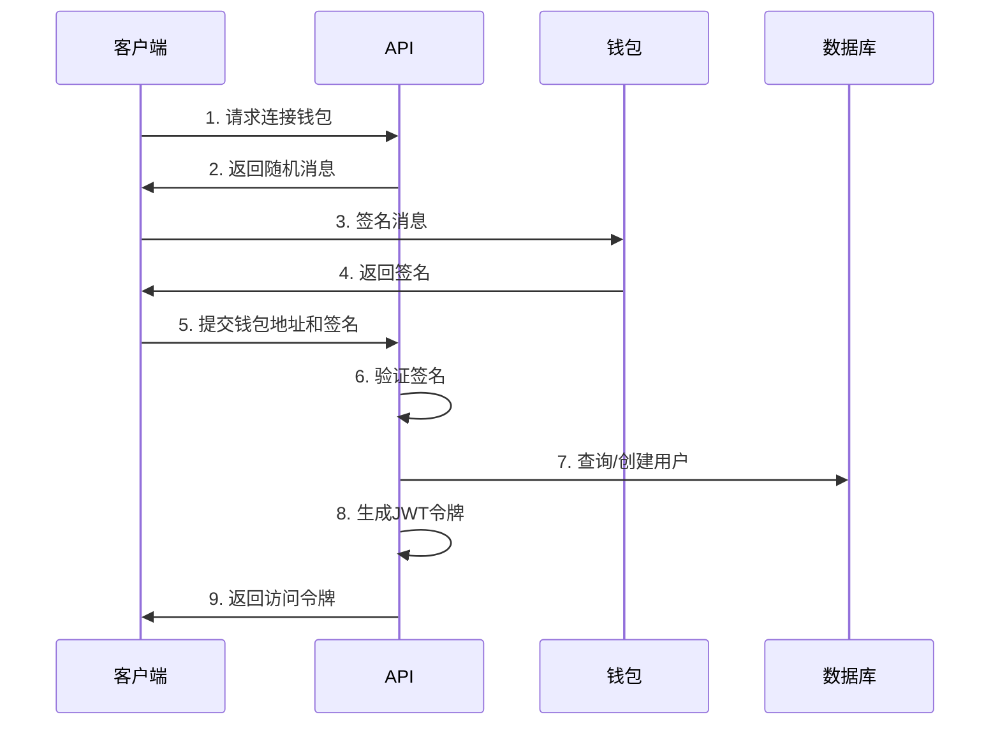

# GCCC API 规范设计

## 概述

本文档定义了 GCCC 项目后端 API 的设计规范和通用约定，包括请求响应格式、错误处理、认证授权、版本控制等内容。所有 API 接口都应遵循这些规范。

## API 设计原则

### 1. RESTful 设计

采用 REST 架构风格，遵循以下原则：

- **资源导向**: URL 表示资源，使用名词而非动词
- **HTTP 方法**: 使用标准 HTTP 方法表示操作
- **无状态**: 每个请求包含完整的处理信息
- **统一接口**: 一致的接口设计和命名约定

### 2. HTTP 方法使用规范

| 方法   | 用途         | 幂等性 | 安全性 | 示例                       |
| ------ | ------------ | ------ | ------ | -------------------------- |
| GET    | 获取资源     | ✅     | ✅     | `GET /api/v1/users/123`    |
| POST   | 创建资源     | ❌     | ❌     | `POST /api/v1/users`       |
| PUT    | 完整更新资源 | ✅     | ❌     | `PUT /api/v1/users/123`    |
| PATCH  | 部分更新资源 | ❌     | ❌     | `PATCH /api/v1/users/123`  |
| DELETE | 删除资源     | ✅     | ❌     | `DELETE /api/v1/users/123` |

### 3. URL 设计规范

```
# 基础格式
{scheme}://{host}/{api_prefix}/{version}/{resource}[/{id}][/{sub_resource}]

# 示例
https://api.gccc.com/api/v1/users/123/wallets
https://api.gccc.com/api/v1/proposals/456/votes
https://api.gccc.com/api/v1/staking/pools/789/records
```

**命名约定**:

- 使用小写字母和连字符
- 资源名使用复数形式
- 避免嵌套超过 3 层
- 使用语义化的 URL

## 请求格式规范

### 1. 请求头 (Headers)

#### 必需请求头

```http
Content-Type: application/json
Accept: application/json
User-Agent: GCCC-Client/1.0.0
```

#### 认证请求头

```http
Authorization: Bearer {jwt_token}
```

#### 可选请求头

```http
X-Request-ID: uuid           # 请求追踪ID
X-Client-Version: 1.0.0      # 客户端版本
Accept-Language: zh-CN       # 首选语言
```

### 2. 查询参数 (Query Parameters)

#### 分页参数

```
GET /api/v1/users?page=1&limit=20&sort=created_at&order=desc
```

| 参数    | 类型    | 默认值     | 说明               |
| ------- | ------- | ---------- | ------------------ |
| `page`  | integer | 1          | 页码，从 1 开始    |
| `limit` | integer | 20         | 每页数量，最大 100 |
| `sort`  | string  | created_at | 排序字段           |
| `order` | string  | desc       | 排序方向: asc/desc |

#### 过滤参数

```
GET /api/v1/proposals?status=active&category=governance&user_id=123
```

#### 字段选择

```
GET /api/v1/users?fields=id,username,email,created_at
```

#### 搜索参数

```
GET /api/v1/users?search=john&search_fields=username,email
```

### 3. 请求体 (Request Body)

#### JSON 格式示例

```json
{
  "username": "john_doe",
  "email": "john@example.com",
  "profile": {
    "avatar_url": "https://example.com/avatar.jpg",
    "bio": "GCCC enthusiast"
  },
  "preferences": {
    "notifications": true,
    "language": "zh-CN"
  }
}
```

#### 文件上传

```http
Content-Type: multipart/form-data

file: [binary data]
metadata: {"name": "avatar", "type": "image"}
```

## 响应格式规范

### 1. 成功响应格式

```json
{
  "success": true,
  "data": {
    // 实际数据内容
  },
  "message": "操作成功",
  "timestamp": "2025-09-04T10:00:00.000Z",
  "request_id": "req_1234567890abcdef"
}
```

### 2. 分页响应格式

```json
{
  "success": true,
  "data": {
    "items": [
      // 数据项数组
    ],
    "pagination": {
      "page": 1,
      "limit": 20,
      "total": 100,
      "pages": 5,
      "has_prev": false,
      "has_next": true
    }
  },
  "message": "查询成功",
  "timestamp": "2025-09-04T10:00:00.000Z"
}
```

### 3. 空数据响应

```json
{
  "success": true,
  "data": null, // 或 [] 对于列表
  "message": "无数据",
  "timestamp": "2025-09-04T10:00:00.000Z"
}
```

## 错误处理规范

### 1. 错误响应格式

```json
{
  "success": false,
  "error": {
    "code": "VALIDATION_ERROR",
    "message": "请求参数验证失败",
    "details": {
      "field": "email",
      "value": "invalid-email",
      "constraint": "必须是有效的邮箱地址"
    }
  },
  "timestamp": "2025-09-04T10:00:00.000Z",
  "request_id": "req_1234567890abcdef"
}
```

### 2. HTTP 状态码使用

| 状态码             | 名称                  | 使用场景             | 错误代码前缀 |
| ------------------ | --------------------- | -------------------- | ------------ |
| **2xx 成功**       |
| 200                | OK                    | 请求成功             | -            |
| 201                | Created               | 资源创建成功         | -            |
| 204                | No Content            | 删除成功，无返回内容 | -            |
| **4xx 客户端错误** |
| 400                | Bad Request           | 请求参数错误         | VALIDATION\_ |
| 401                | Unauthorized          | 未认证               | AUTH\_       |
| 403                | Forbidden             | 无权限               | PERMISSION\_ |
| 404                | Not Found             | 资源不存在           | NOT*FOUND*   |
| 409                | Conflict              | 资源冲突             | CONFLICT\_   |
| 422                | Unprocessable Entity  | 业务逻辑错误         | BUSINESS\_   |
| 429                | Too Many Requests     | 请求频率限制         | RATE*LIMIT*  |
| **5xx 服务器错误** |
| 500                | Internal Server Error | 服务器内部错误       | INTERNAL\_   |
| 502                | Bad Gateway           | 网关错误             | GATEWAY\_    |
| 503                | Service Unavailable   | 服务不可用           | SERVICE\_    |

### 3. 标准错误代码

#### 验证错误 (4xx)

```json
{
  "code": "VALIDATION_ERROR",
  "message": "参数验证失败",
  "details": {
    "field": "email",
    "constraint": "format"
  }
}
```

#### 认证错误 (401)

```json
{
  "code": "AUTH_TOKEN_EXPIRED",
  "message": "认证令牌已过期",
  "details": {
    "expired_at": "2025-09-04T09:00:00.000Z"
  }
}
```

#### 权限错误 (403)

```json
{
  "code": "PERMISSION_DENIED",
  "message": "无权限访问该资源",
  "details": {
    "required_permission": "user:read",
    "current_role": "guest"
  }
}
```

#### 资源不存在 (404)

```json
{
  "code": "NOT_FOUND_USER",
  "message": "用户不存在",
  "details": {
    "user_id": "123"
  }
}
```

#### 业务逻辑错误 (422)

```json
{
  "code": "BUSINESS_INSUFFICIENT_POINTS",
  "message": "积分余额不足",
  "details": {
    "required": "100.00",
    "available": "50.00"
  }
}
```

#### 频率限制 (429)

```json
{
  "code": "RATE_LIMIT_EXCEEDED",
  "message": "请求频率超出限制",
  "details": {
    "limit": 100,
    "window": "1h",
    "retry_after": 3600
  }
}
```

## 认证授权规范

### 1. JWT 令牌格式

```json
{
  "header": {
    "alg": "HS256",
    "typ": "JWT"
  },
  "payload": {
    "sub": "user_123", // 用户ID
    "iss": "gccc-api", // 签发者
    "aud": "gccc-client", // 接收者
    "exp": 1725451200, // 过期时间
    "iat": 1725447600, // 签发时间
    "jti": "token_uuid", // 令牌ID
    "type": "access", // 令牌类型
    "user": {
      "id": "user_123",
      "username": "john_doe",
      "email": "john@example.com",
      "role": "user",
      "permissions": ["user:read", "proposal:create"]
    }
  }
}
```

### 2. 权限控制

#### 基于角色的权限控制 (RBAC)

```json
{
  "roles": {
    "guest": {
      "permissions": ["public:read"]
    },
    "user": {
      "permissions": [
        "user:read",
        "user:update",
        "proposal:read",
        "proposal:create",
        "vote:create",
        "points:read"
      ]
    },
    "admin": {
      "permissions": [
        "*:*" // 所有权限
      ]
    }
  }
}
```

#### 权限检查中间件

```javascript
// 权限注解示例
/**
 * @permission user:read
 * @permission proposal:create
 */
router.post(
  "/proposals",
  requirePermissions(["proposal:create"]),
  createProposal
);
```

### 3. 认证流程



## 版本控制规范

### 1. 版本控制策略

- **URL 版本控制**: `/api/v1/`, `/api/v2/`
- **语义化版本**: 主版本.次版本.修订号
- **向后兼容**: 在一个主版本内保持向后兼容
- **废弃通知**: 提前通知即将废弃的 API

### 2. 版本生命周期

| 阶段     | 说明           | HTTP 头                |
| -------- | -------------- | ---------------------- |
| 当前版本 | 最新稳定版本   | `API-Version: 1.0`     |
| 支持版本 | 仍在维护的版本 | `API-Version: 0.9`     |
| 废弃版本 | 即将停止支持   | `API-Deprecated: true` |
| 停用版本 | 不再支持       | `410 Gone`             |

### 3. 版本迁移

```json
{
  "success": false,
  "error": {
    "code": "API_VERSION_DEPRECATED",
    "message": "当前API版本即将废弃",
    "details": {
      "current_version": "v1",
      "latest_version": "v2",
      "migration_guide": "https://docs.gccc.com/api/v2/migration",
      "sunset_date": "2025-12-31"
    }
  }
}
```

## 安全规范

### 1. 数据验证

#### 输入验证规则

```javascript
const userSchema = {
  username: {
    type: "string",
    minLength: 3,
    maxLength: 50,
    pattern: "^[a-zA-Z0-9_-]+$",
  },
  email: {
    type: "string",
    format: "email",
    maxLength: 255,
  },
  points: {
    type: "number",
    minimum: 0,
    maximum: 999999999999,
  },
};
```

#### 输出编码

- HTML 编码: 防止 XSS 攻击
- JSON 编码: 防止 JSON 注入
- URL 编码: 防止 URL 注入

### 2. 频率限制

```http
# 响应头
X-RateLimit-Limit: 1000
X-RateLimit-Remaining: 999
X-RateLimit-Reset: 1625097600
Retry-After: 3600
```

#### 频率限制策略

| 用户类型 | 限制规则      | 窗口期 |
| -------- | ------------- | ------ |
| 游客     | 100 次/小时   | 1 小时 |
| 普通用户 | 1000 次/小时  | 1 小时 |
| VIP 用户 | 5000 次/小时  | 1 小时 |
| 管理员   | 10000 次/小时 | 1 小时 |

### 3. CORS 配置

```javascript
const corsOptions = {
  origin: [
    "https://gccc.com",
    "https://app.gccc.com",
    "https://admin.gccc.com",
  ],
  methods: ["GET", "POST", "PUT", "PATCH", "DELETE"],
  allowedHeaders: [
    "Content-Type",
    "Authorization",
    "X-Request-ID",
    "X-Client-Version",
  ],
  exposedHeaders: [
    "X-RateLimit-Limit",
    "X-RateLimit-Remaining",
    "X-RateLimit-Reset",
  ],
  credentials: true,
  maxAge: 86400,
};
```

## 性能规范

### 1. 响应时间目标

| API 类型 | 目标响应时间 | 最大响应时间 |
| -------- | ------------ | ------------ |
| 认证相关 | < 100ms      | < 200ms      |
| 用户查询 | < 200ms      | < 500ms      |
| 列表查询 | < 300ms      | < 1s         |
| 复杂业务 | < 500ms      | < 2s         |
| 报表查询 | < 1s         | < 5s         |

### 2. 缓存策略

#### HTTP 缓存头

```http
# 静态资源
Cache-Control: public, max-age=31536000, immutable

# 用户数据
Cache-Control: private, max-age=300

# 实时数据
Cache-Control: no-cache, must-revalidate

# ETag支持
ETag: "version-123"
If-None-Match: "version-123"
```

#### 应用层缓存

```javascript
// Redis缓存键规范
const cacheKeys = {
  user: (id) => `user:${id}`,
  userProfile: (id) => `user:${id}:profile`,
  proposals: (page, limit) => `proposals:${page}:${limit}`,
  stakingPools: () => "staking:pools:active",
};
```

### 3. 分页优化

```sql
-- 游标分页（推荐）
SELECT * FROM users
WHERE created_at < '2025-09-04T10:00:00.000Z'
ORDER BY created_at DESC
LIMIT 20;

-- 传统分页（小数据量）
SELECT * FROM users
ORDER BY created_at DESC
LIMIT 20 OFFSET 0;
```

## 文档规范

### 1. OpenAPI 规范

```yaml
# API文档示例
paths:
  /api/v1/users:
    get:
      summary: 获取用户列表
      description: 获取系统中的用户列表，支持分页和过滤
      parameters:
        - name: page
          in: query
          schema:
            type: integer
            minimum: 1
            default: 1
      responses:
        "200":
          description: 成功获取用户列表
          content:
            application/json:
              schema:
                $ref: "#/components/schemas/UserListResponse"
```

### 2. 代码注释规范

```javascript
/**
 * 创建新用户
 *
 * @route POST /api/v1/users
 * @access Public
 * @param {Object} req.body - 用户创建请求
 * @param {string} req.body.username - 用户名 (3-50字符)
 * @param {string} req.body.email - 邮箱地址
 * @param {string} [req.body.avatar_url] - 头像URL
 * @returns {Object} 201 - 创建成功
 * @returns {Object} 400 - 参数验证失败
 * @returns {Object} 409 - 用户名或邮箱已存在
 * @example
 * // 请求示例
 * POST /api/v1/users
 * {
 *   "username": "john_doe",
 *   "email": "john@example.com"
 * }
 *
 * // 响应示例
 * {
 *   "success": true,
 *   "data": {
 *     "id": "user_123",
 *     "username": "john_doe",
 *     "email": "john@example.com"
 *   }
 * }
 */
async function createUser(req, res) {
  // 实现逻辑
}
```

## 测试规范

### 1. API 测试类型

- **单元测试**: 测试单个函数或方法
- **集成测试**: 测试 API 端点和数据库交互
- **端到端测试**: 测试完整的用户场景
- **性能测试**: 测试 API 响应时间和并发能力

### 2. 测试用例结构

```javascript
describe("POST /api/v1/users", () => {
  describe("when valid data is provided", () => {
    it("should create a new user and return 201", async () => {
      const userData = {
        username: "test_user",
        email: "test@example.com",
      };

      const response = await request(app)
        .post("/api/v1/users")
        .send(userData)
        .expect(201);

      expect(response.body.success).toBe(true);
      expect(response.body.data.username).toBe(userData.username);
    });
  });

  describe("when invalid data is provided", () => {
    it("should return 400 for invalid email", async () => {
      const userData = {
        username: "test_user",
        email: "invalid-email",
      };

      const response = await request(app)
        .post("/api/v1/users")
        .send(userData)
        .expect(400);

      expect(response.body.success).toBe(false);
      expect(response.body.error.code).toBe("VALIDATION_ERROR");
    });
  });
});
```

## 监控和日志

### 1. 请求日志格式

```json
{
  "timestamp": "2025-09-04T10:00:00.000Z",
  "level": "INFO",
  "message": "API Request",
  "request_id": "req_1234567890abcdef",
  "method": "POST",
  "url": "/api/v1/users",
  "status_code": 201,
  "response_time": 150,
  "user_id": "user_123",
  "ip_address": "192.168.1.100",
  "user_agent": "GCCC-Client/1.0.0",
  "request_size": 256,
  "response_size": 512
}
```

### 2. 错误日志格式

```json
{
  "timestamp": "2025-09-04T10:00:00.000Z",
  "level": "ERROR",
  "message": "Database connection failed",
  "request_id": "req_1234567890abcdef",
  "error_code": "DATABASE_CONNECTION_ERROR",
  "stack_trace": "Error: Connection timeout\n    at Database.connect...",
  "user_id": "user_123",
  "metadata": {
    "database_host": "db.gccc.com",
    "timeout": 5000
  }
}
```

### 3. 性能监控指标

- **响应时间**: P50, P95, P99 延迟
- **吞吐量**: 每秒请求数 (RPS)
- **错误率**: 4xx 和 5xx 错误比例
- **可用性**: 服务正常运行时间
- **资源使用**: CPU、内存、数据库连接数

---

> 📘 **提示**: 本规范是 API 设计的基础指南，在实际开发中应根据具体业务需求进行适当调整。建议定期回顾和更新规范，确保与最佳实践保持一致。
