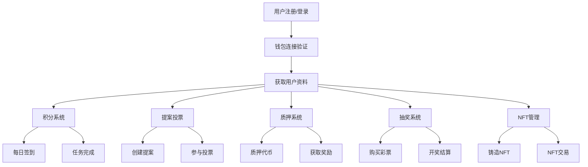

# GCCC 后端 API 设计文档

## 文档概述

本目录包含 GCCC 项目后端 API 的详细设计文档，涵盖所有业务模块的 API 接口规范、数据模型、架构设计等内容。

## 📋 文档目录

### 核心设计文档

- **[架构设计](./01-architecture-design.md)** - 系统架构和技术栈设计
- **[数据模型](./02-data-models.md)** - 数据库模型和实体关系
- **[API 规范](./03-api-specifications.md)** - 通用 API 设计规范和约定
- **[认证授权](./04-authentication-authorization.md)** - 认证和权限控制设计

### 业务模块文档

- **[用户管理模块](./05-user-management-api.md)** - 用户注册、资料、KYC 等 API
- **[积分系统模块](./06-points-system-api.md)** - 积分获取、消费、历史等 API
- **[提案投票模块](./07-proposals-voting-api.md)** - 提案创建、投票、统计等 API
- **[质押系统模块](./08-staking-system-api.md)** - 质押、赎回、奖励等 API
- **[抽奖系统模块](./09-lottery-system-api.md)** - 抽奖创建、参与、开奖等 API
- **[NFT 管理模块](./10-nft-management-api.md)** - NFT 铸造、转移、市场等 API
- **[管理员模块](./11-admin-management-api.md)** - 系统管理、监控等 API

### 运维和部署

- **[部署指南](./12-deployment-guide.md)** - 生产环境部署和配置
- **[监控运维](./13-monitoring-operations.md)** - 系统监控、日志、性能优化
- **[测试策略](./14-testing-strategy.md)** - 单元测试、集成测试、E2E 测试

## 🚀 快速开始

### 1. 技术栈概览

```
后端技术栈:
├── 运行环境: Node.js 18+
├── Web框架: Express.js
├── 数据库: PostgreSQL 15+
├── 缓存: Redis 6+
├── 区块链: Solana Web3.js
├── 认证: JWT + 钱包签名
├── 文档: Swagger/OpenAPI 3.0
└── 容器化: Docker + Docker Compose
```

### 2. API 基础信息

- **Base URL**: `https://api.gccc.com` (生产) / `http://localhost:3001` (开发)
- **API 版本**: v1
- **请求格式**: JSON
- **响应格式**: JSON
- **字符编码**: UTF-8
- **认证方式**: Bearer Token (JWT)

### 3. 通用响应格式

```json
{
  "success": true,
  "data": {
    // 实际数据内容
  },
  "message": "操作成功",
  "timestamp": "2025-09-04T10:00:00.000Z"
}
```

### 4. 错误响应格式

```json
{
  "success": false,
  "error": {
    "code": "VALIDATION_ERROR",
    "message": "参数验证失败",
    "details": {
      "field": "email",
      "message": "邮箱格式不正确"
    }
  },
  "timestamp": "2025-09-04T10:00:00.000Z"
}
```

## 📊 API 模块概览

### 核心业务流程



### API 模块统计

| 模块     | 接口数量   | 状态       | 优先级 |
| -------- | ---------- | ---------- | ------ |
| 认证授权 | 8 个       | ✅ 已完成  | 高     |
| 用户管理 | 12 个      | ✅ 已完成  | 高     |
| 积分系统 | 10 个      | ✅ 已完成  | 高     |
| 提案投票 | 15 个      | ✅ 已完成  | 中     |
| 质押系统 | 18 个      | ✅ 已完成  | 中     |
| 抽奖系统 | 14 个      | ✅ 已完成  | 中     |
| NFT 管理 | 16 个      | ✅ 已完成  | 低     |
| 管理员   | 20 个      | ✅ 已完成  | 高     |
| **总计** | **113 个** | **已完成** | -      |

## 🔧 开发规范

### 1. 命名约定

- **路由命名**: 使用复数形式，如 `/users`, `/proposals`
- **控制器方法**: 使用动词开头，如 `createUser`, `getUserProfile`
- **数据库字段**: 使用下划线命名，如 `created_at`, `user_id`
- **常量**: 使用大写和下划线，如 `MAX_POINTS_PER_DAY`

### 2. 状态码规范

| 状态码 | 含义       | 使用场景              |
| ------ | ---------- | --------------------- |
| 200    | 成功       | GET 请求成功          |
| 201    | 创建成功   | POST 请求成功创建资源 |
| 400    | 请求错误   | 参数验证失败          |
| 401    | 未认证     | 缺少或无效的认证信息  |
| 403    | 无权限     | 认证用户无访问权限    |
| 404    | 未找到     | 请求的资源不存在      |
| 409    | 冲突       | 资源已存在或状态冲突  |
| 429    | 频率限制   | 请求过于频繁          |
| 500    | 服务器错误 | 内部服务器错误        |

### 3. 安全规范

- **输入验证**: 所有输入参数必须经过验证
- **SQL 注入防护**: 使用参数化查询
- **XSS 防护**: 输出编码和 CSP 策略
- **CSRF 防护**: 使用 CSRF 令牌
- **频率限制**: API 调用频率限制
- **敏感数据**: 加密存储密码等敏感信息

## 📈 性能指标

### 响应时间目标

| API 类型 | 目标响应时间 | 备注           |
| -------- | ------------ | -------------- |
| 认证相关 | < 100ms      | 缓存 JWT 验证  |
| 用户查询 | < 200ms      | 包含数据库查询 |
| 业务操作 | < 500ms      | 包含区块链交互 |
| 报表查询 | < 1s         | 复杂聚合查询   |
| 文件上传 | < 5s         | 取决于文件大小 |

### 并发处理能力

- **目标 QPS**: 1000+ (单实例)
- **最大并发连接**: 10000+
- **数据库连接池**: 50 个连接
- **Redis 连接池**: 20 个连接

## 📝 变更记录

| 版本  | 日期       | 变更内容                | 作者      |
| ----- | ---------- | ----------------------- | --------- |
| 1.0.0 | 2025-09-04 | 初始版本，完整 API 设计 | GCCC 团队 |

## 🤝 贡献指南

1. **代码规范**: 遵循 ESLint 和 Prettier 配置
2. **测试要求**: 新功能必须包含单元测试
3. **文档更新**: API 变更需同步更新文档
4. **Code Review**: 所有代码需要通过审查
5. **版本控制**: 使用语义化版本控制

## 📞 联系支持

- **技术支持**: tech-support@gccc.com
- **API 问题**: api-support@gccc.com
- **文档反馈**: docs@gccc.com
- **GitHub Issues**: https://github.com/barbarossia/GCCC/issues

---

> 📘 **提示**: 建议按照文档顺序阅读，从架构设计开始，逐步了解各个模块的详细设计。每个模块都包含完整的 API 规范、示例代码和测试用例。
